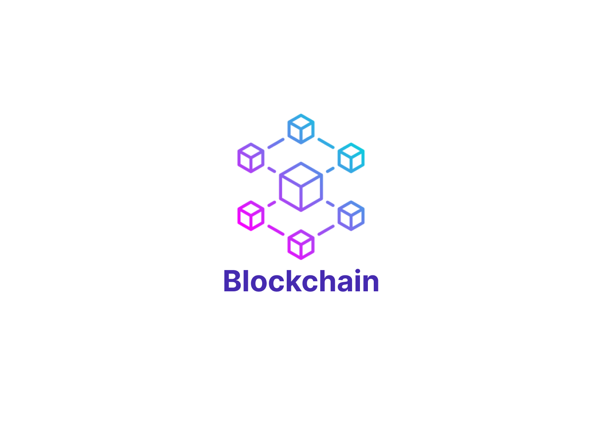
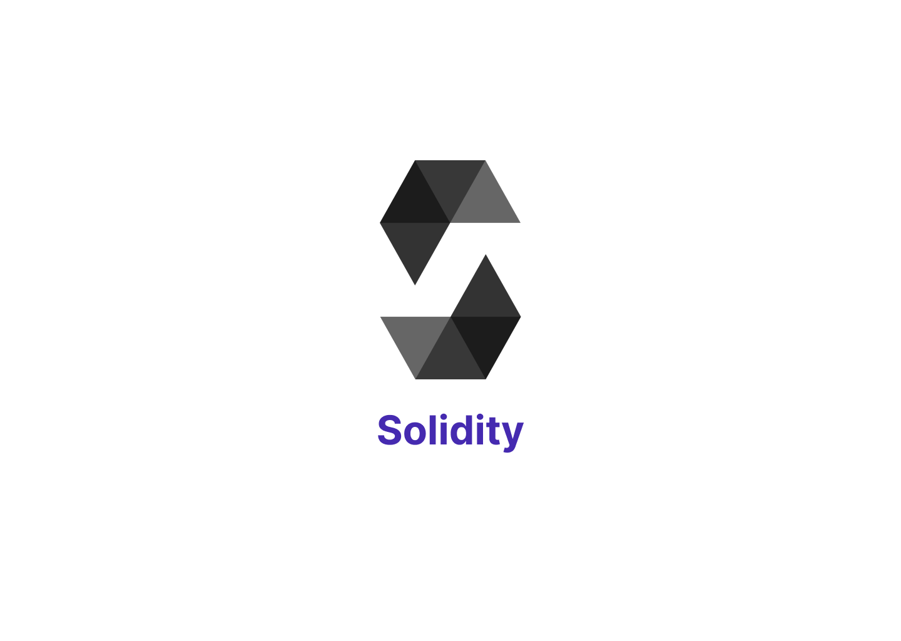

# Blockchain Interview Questions

Welcome to our Github repository that contains a comprehensive list of Blockchain interview questions for both beginners and advanced users. Blockchain technology has gained immense popularity over the past few years, and it's increasingly being used in various industries, including finance, healthcare, and supply chain management.

If you're looking to get into the Blockchain industry or want to enhance your knowledge in this field, this repository is a great resource for you. It contains a list of interview questions that you may encounter during job interviews, technical assessments, or other Blockchain-related examinations.

The questions in this repository are divided into several categories, including Blockchain basics, Ethereum, Smart Contracts, Consensus mechanisms, and security. This categorization makes it easier for you to find the specific area you need to brush up on.

We encourage the community to contribute to this repository by adding new questions or updating existing ones. Your contributions will help make this repository even more useful to everyone seeking to improve their knowledge of Blockchain technology.

Thank you for visiting this repository, and we hope that you will find it helpful in your Blockchain journey.

## Here is an example table of contents for the Blockchain Interview Question:

## Table of Contents

### Blockchain

| No. | Questions                                                                                    |
| --- | -------------------------------------------------------------------------------------------- |
| 01  | [What is Blockchain?](#what-is-blockchain)                                                   |
| 02  | [How does Blockchain work?](#how-does-blockchain-work)                                       |
| 03  | [What are the benefits of Blockchain?](#what-are-the-benefits-of-blockchain)                 |
| 04  | [What is a blockchain ledger?](#What-is-a-blockchain-ledger)                                 |
| 05  | [What is a block in blockchain?](#What-is-a-block-in-blockchain)                             |
| 06  | [What is a node in blockchain?](#What-is-a-node-in-blockchain)                               |
| 07  | [What is a hash in blockchain?](#What-is-a-hash-in-blockchain)                               |
| 08  | [What is a consensus mechanism in blockchain?](#What-is-a-consensus-mechanism-in-blockchain) |
| 09  | [What is a Genesis Block?](#What-is-a-genesis-block)                                         |
| 10  | [What are the different types of Blockchains?](#what-are-the-different-types-of-blockchains) |
| 11  | [What are off-chain transactions?](#what-are-off-chain-transactions)                         |
| 12  | [What is 51% attack? ](#what-is-51%-attack)                                                  |
| 13  | [What is a token? ](#what-is-a-token)                                                        |
| 14  | [What is a cryptocurrency? ](#what-is-a-cryptocurrency)                                      |
| 15  | [What is a wallet? ](#what-is-a-wallet)                                                      |
| 16  | [What is a hash function? ](#what-is-a-hash-function)                                        |
| 17  | [What is cryptography? ](#what-is-cryptography)                                              |
| 18  | [What is Bitcoin? ](#what-is-bitcoin)                                                        |
| 19  | [What is Ethereum? ](#what-is-ethereum)                                                      |
| 20  | [What is IPFS?](#what-is-ipfs)                                                               |
| 21  | [What is a Blockchain Explorer??](#what-is-a-blockchain-explorer)                            |

## Solidity Questions:

| No. | Questions                                                                                                                                                                                |
| --- | ---------------------------------------------------------------------------------------------------------------------------------------------------------------------------------------- |
| 01  | [What is Solidity?](#what-is-solidity)                                                                                                                                                   |
| 02  | [What is the purpose of the "pragma solidity" statement at the beginning of a Solidity file?](#what-is-the-purpose-of-the-pragma-solidity-statement-at-the-beginning-of-a-solidity-file) |
| 03  | [What is the difference between a uint and an int in Solidity?](#what-is-the-difference-between-a-uint-and-an-int-in-solidity)                                                           |
| 04  | [Can a Solidity variable change its data type?](#can-a-solidity-variable-change-its-data-type)                                                                                           |
| 05  | [Can a Solidity variable be assigned a default value?](#can-a-solidity-variable-be-assigned-a-default-value)                                                                             |
| 06  | [What is the data type for storing Ethereum addresses in Solidity?](#what-is-the-data-type-for-storing-ethereum-addresses-in-solidity)                                                   |
| 07  | [What is a constructor in Solidity and how to use it?](#what-is-a-constructor-in-solidity-and-how-to-use-it)                                                                             |
| 08  | [ How do you handle errors and exceptions in Solidity?](#how-do-you-handle-errors-and-exceptions-in-solidity)                                                                            |
| 09  | [What is a modifier in Solidity and how do you use it?](#what-is-a-modifier-in-solidity-and-how-do-you-use-it)                                                                           |



## Blockchain Answers

1. ### What is Blockchain?

   Blockchain technology is a distributed ledger technology that enables secure, transparent and tamper-proof transactions. It uses cryptographic algorithms to ensure the authenticity and integrity of the data being shared among the participants in a decentralized network.

   **Let's Understand By an Example:**

   Imagine you have a notebook that you use to keep track of things like your chores or your allowance. Each time you do a chore or receive your allowance, you write it down in your notebook.

   Now imagine that instead of just one notebook, you have a whole bunch of notebooks that are exactly the same, and each time you make an entry in one of them, all of the other notebooks automatically update to match.

   That's kind of what blockchain technology is like. It's a way to keep track of things like transactions, but instead of just one ledger, there are many identical ledgers that are all updated at the same time.

   And the really cool thing about blockchain is that it uses special codes and math to make sure that the information in the ledgers is always accurate and can't be changed without everyone else knowing. That means it's really secure and people can trust that the information is true.

   So, in short, blockchain is a way to keep track of things that's very secure and trustworthy, because lots of people are keeping track of the same thing at the same time and can all check to make sure the information is correct.

   **[⬆ Back to Top](#table-of-contents)**

2. ### How does Blockchain work?

   Blockchain is a technology that keeps a record of transactions in a secure and unchangeable way. It works by creating a series of blocks that hold transaction information. Each block contains a code that links it to the block before it, making sure that the data cannot be changed. The transactions are confirmed and added to the blockchain by a group of people who agree on them. This makes sure that the data is accurate and can be trusted.

   **[⬆ Back to Top](#table-of-contents)**

3. ### What are the benefits of Blockchain?

   The benefits of blockchain include increased security, transparency, and efficiency in transactions. It can help reduce the need for intermediaries and reduce transaction costs. It also enables better tracking and tracing of goods, which can help increase trust and reduce fraud

   **[⬆ Back to Top](#table-of-contents)**

4. ### What is a blockchain ledger?

   A blockchain ledger is a database that stores information about transactions or data in a blockchain.

   **[⬆ Back to Top](#table-of-contents)**

5. ### What is a block in blockchain?

   A block in blockchain is a group of transactions or data that are added to the blockchain.

   **[⬆ Back to Top](#table-of-contents)**

6. ### What is a node in blockchain?

   A node in blockchain is a computer that participates in the network by storing a copy of the blockchain ledger.

   **[⬆ Back to Top](#table-of-contents)**

7. ### What is a hash in blockchain?

   A hash in blockchain is a unique code that represents a block of information.

   **[⬆ Back to Top](#table-of-contents)**

8. ### What is a consensus mechanism in blockchain?

   A consensus mechanism is a way for everyone in the network to agree on what information should be added to the blockchain.

   **[⬆ Back to Top](#table-of-contents)**

9. ### What is a Genesis Block?

   A Genesis Block is the very first block in a blockchain network. It is usually hardcoded into the blockchain software and serves as the foundation for the entire blockchain.

   The Genesis Block is different from all subsequent blocks in the chain because it does not reference a previous block (since there is no previous block). Instead, it typically contains a special message or unique data that identifies it as the first block in the chain.

   **[⬆ Back to Top](#table-of-contents)**

10. ### What are the different types of Blockchains?

    There are three main types of blockchains: public, private, and consortium (also known as federated).

    1. Public Blockchains: These are fully decentralized blockchains that are open to anyone to join and participate in. Anyone can create a new block, validate transactions, and earn rewards. Examples of public blockchains include Bitcoin, Ethereum, and Litecoin.
    2. Private Blockchains: These blockchains are controlled by a single organization or group and are not open to the public. Participants in the network are known and trusted, and access to the blockchain is restricted. Private blockchains are often used by companies or organizations to store sensitive data or conduct internal transactions.
    3. Consortium or Federated Blockchains: These are blockchains that are controlled by a group of organizations, rather than a single entity. Consortium blockchains are typically used for business applications where multiple organizations need to share data and collaborate on a common platform. Examples of consortium blockchains include R3 Corda and Hyperledger Fabric.

**[⬆ Back to Top](#table-of-contents)**

11. ### What are off-chain transactions?
    An off-chain transaction is the movement of value outside of the blockchain. While an on-chain transaction – usually referred to as simply ‘a transaction’ – modifies the blockchain and depends on the blockchain to determine its validity an off-chain transaction relies on other methods to record and validate the transaction.

**[⬆ Back to Top](#table-of-contents)**

12. ### What is 51% attack?
    51% Attack refers to a situation where a group of miners who hold more than 50% of the Network Hash Rate could manipulate with the New transactions (Stopping the transactions to proceed or gaining conformations) or able to reverse the transactions that were recently confirmed and kind of doing Double spend. It is Highly unlikely to be able to do that today but it is possible.

**[⬆ Back to Top](#table-of-contents)**

13. ### What is a token?

    A token is a digital asset that is issued and managed on a blockchain. It can represent a variety of assets, such as a currency, a commodity, or a utility.

    **[⬆ Back to Top](#table-of-contents)**

14. ### What is a cryptocurrency?

    A cryptocurrency is a digital or virtual currency that uses cryptography to secure and verify transactions and to control the creation of new units. Bitcoin is the first and most well-known cryptocurrency, but there are now thousands of others in existence.

    **[⬆ Back to Top](#table-of-contents)**

15. ### What is a wallet?

    A wallet is a software program that is used to store, manage, and transfer digital assets on a blockchain. It can be used to send and receive assets, view transaction history, and manage private keys.

    **[⬆ Back to Top](#table-of-contents)**

16. ### What is a hash function?

    A hash function is a mathematical algorithm that takes input data of any size and produces a fixed-size output, called a hash or a digest. Hash functions are an essential component of blockchain technology, used to ensure the integrity and immutability of the data stored on the blockchain.

    **[⬆ Back to Top](#table-of-contents)**

17. ### What is cryptography?

    Cryptography is the practice of securing communication and data storage against unauthorized access and manipulation. It involves using mathematical algorithms to encrypt data, making it unreadable to anyone without the appropriate decryption key.

    **[⬆ Back to Top](#table-of-contents)**

18. ### What is Bitcoin?

    Bitcoin is the world's first decentralized digital currency and payment system that operates on a peer-to-peer network, without the need for intermediaries like banks or governments. It was created in 2009 by an unknown person or group using the pseudonym Satoshi Nakamoto. Bitcoin transactions are recorded on a public ledger called the blockchain, which is maintained by a network of nodes around the world. Bitcoin has a limited supply of 21 million coins, which are created through a process called mining.

    **[⬆ Back to Top](#table-of-contents)**

19. ### What is Ethereum?

    Ethereum is a computer platform that allows developers to create programs and apps that run on a decentralized network. It has its own digital currency called Ether that is used to pay for transactions and reward the people who help keep the network running. It allows for more complex transactions than Bitcoin and can be used for things like creating digital contracts and voting systems.
    Ethereum also has its own programming language called Solidity, which is used to create smart contracts and dapps. Unlike Bitcoin, Ethereum has no fixed supply limit.

    **[⬆ Back to Top](#table-of-contents)**

20. ### What is IPFS?

    IPFS (InterPlanetary File System) is a distributed file system that provides a decentralized method of storing and accessing files on the internet. It was created to address some of the limitations of traditional centralized file storage systems, such as slow download speeds, high bandwidth costs, and the risk of data loss or censorship.

    At a high level, IPFS works by breaking files into small chunks and distributing them across a network of computers, called nodes, that store and share the data with each other. When a user wants to access a file, they use its unique content-addressed hash to retrieve the chunks of the file from multiple nodes on the network, reassembling the file in their own local storage.

    **[⬆ Back to Top](#table-of-contents)**

21. ### What is a Blockchain Explorer?

    A Blockchain Explorer is a piece of software that draws data from a blockchain using an API and a blockchain node, then uses a database to organize the data and present it to the user in a searchable format.

    **[⬆ Back to Top](#table-of-contents)**




## Solidity Answers

1. ### What is Solidity?

   Solidity is a programming language used to write smart contracts on the Ethereum blockchain. Smart contracts are self-executing contracts with terms of agreement between buyer and seller directly written into code. Solidity is similar to other programming languages like JavaScript and C++, but has specific features for blockchain development such as the ability to interact with the Ethereum Virtual Machine (EVM) and manage digital assets like cryptocurrencies.

   **[⬆ Back to Top](#solidity)**

2. ### What is the purpose of the "pragma solidity" statement at the beginning of a Solidity file?

   The "pragma solidity" statement is used to specify the version of Solidity that the contract is written in, and to ensure compatibility with future versions.

   **[⬆ Back to Top](#solidity)**

3. ### What is the difference between a uint and an int in Solidity?

   A uint is an unsigned integer, meaning it can only store positive whole numbers, while an int is a signed integer, meaning it can store positive or negative whole numbers.

   **[⬆ Back to Top](#solidity)**

4. ### Can a Solidity variable change its data type?

   No, once a variable is declared with a data type, its data type cannot be changed.

   **[⬆ Back to Top](#solidity)**

5. ### Can a Solidity variable be assigned a default value?

   Yes, variables in Solidity can be assigned default values when they are declared. For example: `uint myNumber = 0;`

   **[⬆ Back to Top](#solidity)**

6. ### What is the data type for storing Ethereum addresses in Solidity?

   The data type for storing Ethereum addresses in Solidity is address.

   **[⬆ Back to Top](#solidity)**

7. ### What is a constructor in Solidity and how to use it?

   A constructor is a function that is executed when a contract is created, and is used to initialize the contract's state variables.
   Here is an example of a constructor in Solidity:

   ```solidity
   pragma solidity ^0.8.0;

   contract MyContract {
    string public myString;

    constructor(string memory _myString) {
        myString = _myString;
    }
   }
   ```

   **[⬆ Back to Top](#solidity)**

8. ### How do you handle errors and exceptions in Solidity?

   In Solidity, you can use the `require` function to check conditions and throw an error if the condition is not met. If an error is thrown, the transaction will be reverted and any changes made to the state will be undone.

   ```solidity
   pragma solidity ^0.8.0;

   contract MyContract {
      uint256 public num;

      function doSomething(uint256 _num) public {
         require(_num > 5, "Number should be greater than 5");
       num = _num;
      }
   }
   ```

   **[⬆ Back to Top](#solidity)**

9. ### What is a modifier in Solidity and how do you use it?

   A `modifier` in Solidity is a way to modify the behaviour of a function. You can use a modifier to enforce access control or add additional checks before executing a function.

   ```solidity
   contract Mycontract {
      address public owner;

      constructor()  {
        owner = msg.sender;
      }

      modifier onlyOnwer() {
        require(msg.sender == owner, "Only owner can call this function");
        _;
      }

      function getBalance() public view onlyOnwer returns(uint256){
        return address(this).balance;
      }
   }
   ```

   **[⬆ Back to Top](#solidity)**
